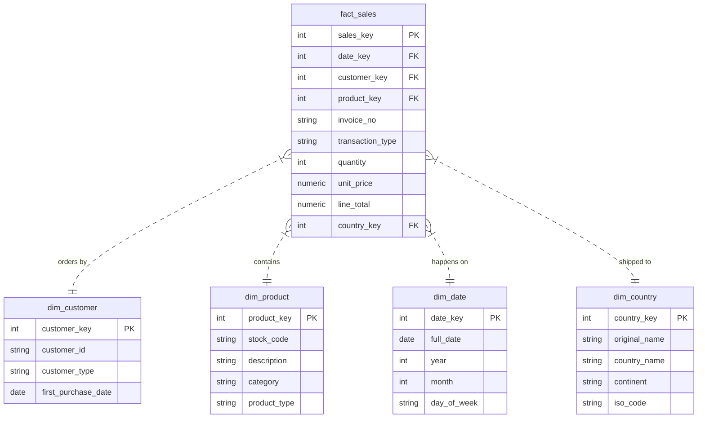

# Data Warehouse Schema Design
**Star Schema - E-Commerce Analytics** | January 20, 2026

---

## Schema Overview



---

## Fact Table: `dwh.fact_sales`
**Grain:** Transaction line level (one row per product per invoice)

| Column | Type | Description |
|--------|------|-------------|
| `sales_key` | SERIAL PK | Surrogate key |
| `date_key` | INTEGER FK | Links to dim_date (YYYYMMDD format) |
| `customer_key` | INTEGER FK | Links to dim_customer |
| `product_key` | INTEGER FK | Links to dim_product |
| `invoice_no` | VARCHAR(20) | Business transaction ID |
| `transaction_type` | VARCHAR(10) | SALE or RETURN |
| `quantity` | INTEGER | Units sold (negative for returns) |
| `unit_price` | NUMERIC(10,2) | Price per unit |
| `line_total` | NUMERIC(10,2) | Pre-calculated: quantity × unit_price |
| `country` | VARCHAR(100) | Shipping destination |

**Design Notes:**
- Returns stored as negative quantities (not separate table)
- `line_total` pre-calculated for query performance
- `invoice_no` is degenerate dimension (no separate table needed)
- `transaction_type` stored in fact table (degenerate dimension): Only 2 values
(SALE/RETURN),
no additional attributes, tightly coupled to quantity sign
- `country` stored in fact table (transaction attribute): Represents shipping destination
per order, not customer's home country. Same customer can ship to different countries across
transactions (e.g., gifts, vacation addresses). Creating dim_country would save only ~6MB
storage while adding JOIN complexity for 541K rows

**Indexes:**
```sql
CREATE INDEX idx_fact_sales_date ON dwh.fact_sales(date_key);
CREATE INDEX idx_fact_sales_customer ON dwh.fact_sales(customer_key);
CREATE INDEX idx_fact_sales_product ON dwh.fact_sales(product_key);
CREATE INDEX idx_fact_sales_type ON dwh.fact_sales(transaction_type);
CREATE INDEX idx_fact_sales_country ON dwh.fact_sales(country);
```

**Constraints:**
```sql
CONSTRAINT unique_invoice_item UNIQUE (invoice_no, product_key)
```

---

## Dimension: `dwh.dim_customer`
**Grain:** One row per unique customer (registered or guest invoice)

| Column | Type | Description |
|--------|------|-------------|
| `customer_key` | SERIAL PK | Surrogate key |
| `customer_id` | VARCHAR(20) UNIQUE | Registered ID or Generated ID ('GST-' + InvoiceNo) |
| `customer_type` | VARCHAR(10) | REGISTERED or GUEST |
| `first_purchase_date` | DATE | First transaction date |

**Guest Customer Logic:**
- **Registered:** Loaded directly using the source `customer_id` (e.g., `17850`).
- **Guest:** Since guests lack a persistent ID, a unique Session ID is generated using
the format `GST-{InvoiceNo}` (e.g., `GST-536365`).

**Indexes:**
```sql
CREATE UNIQUE INDEX idx_dim_customer_id ON dwh.dim_customer(customer_id) 
    WHERE customer_id IS NOT NULL;
CREATE INDEX idx_dim_customer_type ON dwh.dim_customer(customer_type);
```

---

## Dimension: `dwh.dim_product`
**Grain:** One row per unique product

| Column | Type | Description |
|--------|------|-------------|
| `product_key` | SERIAL PK | Surrogate key |
| `stock_code` | VARCHAR(20) UNIQUE | Business key |
| `description` | TEXT | Product name |
| `category` | VARCHAR(100) | Derived from keyword lookup |
| `product_type` | VARCHAR(20) | Physical or Service |

**Category Derivation:**
- Uses keyword matching (use `staging.product_category_lookup`)
- Example: Description contains "MUG" → Category = "Kitchenware"
- Products with no match → Category = "Uncategorized"

**Indexes:**
```sql
CREATE UNIQUE INDEX idx_dim_product_code ON dwh.dim_product(stock_code);
CREATE INDEX idx_dim_product_category ON dwh.dim_product(category);
```

---

## Dimension: `dwh.dim_date`
**Grain:** One row per calendar day

| Column | Type | Description |
|--------|------|-------------|
| `date_key` | INTEGER PK | YYYYMMDD format (e.g., 20101201) |
| `full_date` | DATE UNIQUE | Actual date value |
| `day_of_week` | VARCHAR(10) | Monday, Tuesday, etc. |
| `day_of_month` | INTEGER | 1-31 |
| `month` | INTEGER | 1-12 |
| `month_name` | VARCHAR(10) | January, February, etc. |
| `quarter` | INTEGER | 1-4 |
| `year` | INTEGER | Full year |
| `is_weekend` | BOOLEAN | TRUE for Sat/Sun |

**Design Notes:**
- `date_key` as INTEGER follows Kimball best practices
- `full_date` provides type safety for Superset
- Supports drill-down: Year → Quarter → Month → Day
- Time component from InvoiceDate is **not stored**

**Indexes:**
```sql
CREATE UNIQUE INDEX idx_dim_date_full ON dwh.dim_date(full_date);
CREATE INDEX idx_dim_date_year_month ON dwh.dim_date(year, month);
```

## Dimension: `dwh.dim_country`
**Grain**: One row per unique country

Column | Type | Description |
|------|------|-------------|
| `country_key` | SERIAL PK | Surrogate key |
| `original_name` | VARCHAR | Original name from raw data |
| `country_name` | VARCHAR | Name extracted from API |
| `continent` | VARCHAR | Enriched via API (e.g. Europe) |
| `iso_alpha2` | CHAR(2) | ISO Code (e.g. US) |
| `iso_alpha3` | CHAR(3) | ISO Code (e.g. GBR) |

---

## Sample KPI Queries

**Purpose:** Test schema after ETL, configure Superset datasets

**Usage:** 
- Run after ETL to validate KPIs
- Copy into Superset "Custom SQL" when creating datasets

### KPI 1: Monthly Net Revenue
```sql
SELECT 
    d.year,
    d.month_name,
    SUM(f.line_total) as net_revenue
FROM dwh.fact_sales f
JOIN dwh.dim_date d ON f.date_key = d.date_key
GROUP BY d.year, d.month, d.month_name
ORDER BY d.year, d.month;
```

### KPI 2: Customer Retention Rate
```sql
WITH purchases AS (
    SELECT 
        c.customer_id,
        COUNT(DISTINCT f.invoice_no) as purchase_count
    FROM dwh.fact_sales f
    JOIN dwh.dim_customer c ON f.customer_key = c.customer_key
    WHERE c.customer_type = 'REGISTERED'
    GROUP BY c.customer_id
)
SELECT 
    ROUND(100.0 * COUNT(*) FILTER (WHERE purchase_count >= 2) / COUNT(*), 2) 
    as retention_rate_pct
FROM purchases;
```

### KPI 3: Top 20 Products by Revenue
```sql
SELECT 
    p.description,
    p.category,
    SUM(f.line_total) as total_revenue
FROM dwh.fact_sales f
JOIN dwh.dim_product p ON f.product_key = p.product_key
WHERE f.transaction_type = 'SALE'
GROUP BY p.product_key, p.description, p.category
ORDER BY total_revenue DESC
LIMIT 20;
```

### KPI 4: Return Rate
```sql
SELECT 
    ROUND(100.0 * 
        COUNT(DISTINCT CASE WHEN transaction_type = 'RETURN' THEN invoice_no END) / 
        COUNT(DISTINCT invoice_no), 2
    ) as return_rate_pct
FROM dwh.fact_sales;
```

### KPI 5: Revenue by Country (Top 10 Non-UK)
```sql
SELECT 
    c.country_name,
    SUM(f.line_total) as total_revenue
FROM dwh.fact_sales f
JOIN dwh.dim_country c ON f.country_key = c.country_key  -- Now requires JOIN
WHERE f.transaction_type = 'SALE'
  AND c.country_name != 'United Kingdom'
GROUP BY c.country_name
ORDER BY total_revenue DESC
LIMIT 10;
```

---

## Data Quality Checks (Run After ETL)

```sql
-- Check 1: Product categorization coverage
SELECT 
    ROUND(100.0 * COUNT(*) FILTER (WHERE category = 'Uncategorized') / COUNT(*), 2) as uncategorized_pct
FROM dwh.dim_product;
-- Target: <10%

-- Check 2: Guest customer count validation
SELECT COUNT(*) FROM dwh.dim_customer WHERE customer_type = 'GUEST';
-- Expected: ~3,710 (one per guest invoice)
```

---

**DOCUMENT VERSION:** 1.0  
**LAST UPDATED:** January 20, 2026
