# ELT Pipeline Guide
**Extract, Load, Transform Pipeline** | January 22, 2026

**Orchestration:** n8n | **Database:** PostgreSQL 17.7

---

## 1. Pipeline Flow

```mermaid
graph TD
    A[Manual Trigger] --> B[Truncate source table]
    B --> C[Read CSV from Disk]
    C --> D[Extract from File]
    D --> E[Loop Over Items - Batch 4000]
    E --> F[Insert into source table]
    F --> E
    E --> G[Verify Load Count]
    G --> H[✓ Checkpoint #1: File Check]
    H --> I[Check Critical NULLs]
    I --> J[✓ Checkpoint #2: Validation]
    J --> K[Create staging.clean_sales]
    K --> L[✓ Checkpoint #3: Quality Funnel]
    L --> M[Load dim_date]
    M --> N[Load dim_customer]
    N --> O[Load dim_product]
    O --> OA[Get Unique Countries]
    OA --> OB[Loop Over Countries]
    OB --> OC[HTTP Request API]
    OC --> OD[Preprocess Country Data]
    OD --> OE[Load dim_country]
    OE --> OB
    OB --> P[Check Orphans]
    P --> Q[✓ Checkpoint #4: Validation]
    Q --> R[Load fact_sales]
    R --> S[Check Revenue]
    S --> T[✓ Checkpoint #5: Validation]
    T --> U[Audit Logging]
    U --> V[Gmail Success]
    
    ERROR[Error Trigger] --> FAIL[Send Gmail Alert]
```



**Phase 1:** CSV → `source.ecommerce_raw` (all TEXT) using batched inserts  
**Phase 2:** Transform → `staging.clean_sales` (typed, cleaned, aggregated)  
**Phase 3:** Load → `dwh` schema (Star Schema)  
**Phase 4:** Validation (5 Checkpoints) + Audit Logging + Email Notifications

**Prerequisites:**
- Run [00_initial_setup.md](./00_initial_setup.md) once before first execution

---

## 2. Phase 1: Extract & Load

**Input:** `/files/data.csv` (541,909 rows)  
**Tool:** n8n File Reader → Extract from File → Batched PostgreSQL Insert (4000 rows per batch)

### Step 1: Truncate Source Table

**Logic:** Clear old data before loading fresh data to ensure no duplicates or stale records remain.

```sql
-- Clear the source table before starting a new load
TRUNCATE TABLE source.ecommerce_raw;
```

### Step 2: Read & Extract CSV

**Node Configuration:**
- **Read/Write Files from Disk:** Reads `/files/data.csv`
- **Extract from File:** Parses CSV and converts to JSON
- **Loop Over Items:** Splits data into batches of 4000 rows for efficient bulk loading

### Step 3: Batched Insert to Source

**Logic:** Insert CSV rows into `source.ecommerce_raw` in batches of 4000. Uses `skipOnConflict` to avoid duplicate key errors.

**Column Mapping:**
```javascript
{
  "invoiceno": "={{ $json.InvoiceNo }}",
  "stockcode": "={{ $json.StockCode }}",
  "description": "={{ $json.Description }}",
  "quantity": "={{ $json.Quantity }}",
  "invoicedate": "={{ $json.InvoiceDate }}",
  "unitprice": "={{ $json.UnitPrice }}",
  "customerid": "={{ $json.CustomerID }}",
  "country": "={{ $json.Country }}"
}
```

### Step 4: Verify Load Count

```sql
-- Count total rows loaded into source table
SELECT COUNT(*) as row_count FROM source.ecommerce_raw;
```

### Checkpoint #1: File Validation

**Logic:** Fail immediately if no rows were loaded into the database.

```javascript
// n8n Code Node
const count = parseInt(items[0].json.row_count);

if (count === 0) {
    throw new Error("CRITICAL: 0 rows loaded into DB. Check file path or DB permissions.");
}

return [{ json: { status: 'PASS', loaded_rows: count }}];
```

### Checkpoint #2: Critical NULLs

**Logic:** Fail if any row lacks the essential keys needed to build the Star Schema (`InvoiceNo`, `StockCode`, `InvoiceDate`).

```sql
-- Check for critical NULLs in primary identifying columns
SELECT COUNT(*) as bad_rows
FROM source.ecommerce_raw
WHERE 
   (invoiceno IS NULL OR TRIM(invoiceno) = '')
   OR 
   (stockcode IS NULL OR TRIM(stockcode) = '')
   OR 
   (invoicedate IS NULL OR TRIM(invoicedate) = '');
```

```javascript
// n8n Code Validator
const badRows = items[0].json.bad_rows;
if (badRows > 0) {
    throw new Error(`CRITICAL: Found ${badRows} rows with missing InvoiceNo, StockCode, or Date. Pipeline stopped.`);
}
return [{ json: { status: 'PASS' }}];
```

---

## 3. Phase 2: Transform

### Transformation Logic (Cleaning & Aggregation)

**Logic:**
1. Cast TEXT strings to proper data types (INTEGER, NUMERIC, TIMESTAMP, DATE)
2. Filter out invalid rows (Quantity=0)
3. Aggregate duplicate InvoiceNo+StockCode combinations using GROUP BY
4. Detect RETURNS by checking for 'C' prefix in InvoiceNo OR negative quantity

```sql
-- Drop and recreate the staging table with cleaned, aggregated data
DROP TABLE IF EXISTS staging.clean_sales;

CREATE TABLE staging.clean_sales AS
SELECT 
    invoiceno,
    stockcode,
    MAX(description) as description,
    MAX(country) as country,
    SUM(CAST(quantity AS INTEGER)) as quantity, 
    -- Use MAX for price because it's usually consistent per invoice/product
    MAX(CAST(unitprice AS NUMERIC(10,2))) as unit_price,
    MAX(TO_TIMESTAMP(invoicedate, 'MM/DD/YYYY HH24:MI')) as invoice_timestamp,
    MAX(LEFT(NULLIF(TRIM(customerid), ''), 20)) as customer_id,
    -- IMPROVED: Identify returns by 'C' prefix OR negative quantity
    CASE 
        WHEN LEFT(invoiceno, 1) = 'C' OR SUM(CAST(quantity AS INTEGER)) < 0 THEN 'RETURN' 
        ELSE 'SALE' 
    END as transaction_type,
    MAX(DATE(TO_TIMESTAMP(invoicedate, 'MM/DD/YYYY HH24:MI'))) as invoice_date
FROM source.ecommerce_raw
WHERE CAST(quantity AS INTEGER) != 0 -- Only filter out true "Zero" rows
GROUP BY invoiceno, stockcode;
```

### Checkpoint #3: Quality Funnel

**Logic:** Measure data loss between source and staging to ensure transformation quality.

```sql
SELECT 
    -- 1. Total valid rows in Raw (Everything except 0 quantity)
    (SELECT COUNT(*) FROM source.ecommerce_raw WHERE CAST(quantity AS INTEGER) != 0) as "1. Raw Rows Received",
    
    -- 2. Unique groups we expect to see in Staging
    (SELECT COUNT(DISTINCT (invoiceno || stockcode)) FROM source.ecommerce_raw WHERE CAST(quantity AS INTEGER) != 0) as "2. Expected Unique Rows",
    
    -- 3. Actual rows in Staging
    (SELECT COUNT(*) FROM staging.clean_sales) as "3. Actual Staging Rows",
    
    -- 4. The Gap (Should be 0)
    (SELECT COUNT(DISTINCT (invoiceno || stockcode)) FROM source.ecommerce_raw WHERE CAST(quantity AS INTEGER) != 0) 
    - (SELECT COUNT(*) FROM staging.clean_sales) as "Data Loss Gap"
```

---

## 4. Phase 3: Load to DWH

### 4.1 Load Dimensions

**Logic:** Populate lookup tables with dimensional data.

#### Load Date Dimension

```sql
-- Populate dim_date with full calendar from 2010-2012
INSERT INTO dwh.dim_date (
    date_key, full_date, day_of_week, day_of_month, month, month_name, quarter, year, is_weekend
)
SELECT 
    TO_CHAR(d, 'YYYYMMDD')::INTEGER as date_key,
    d::DATE as full_date,
    TRIM(TO_CHAR(d, 'Day')) as day_of_week,
    EXTRACT(DAY FROM d)::INTEGER as day_of_month,
    EXTRACT(MONTH FROM d)::INTEGER as month,
    TRIM(TO_CHAR(d, 'Month')) as month_name,
    EXTRACT(QUARTER FROM d)::INTEGER as quarter,
    EXTRACT(YEAR FROM d)::INTEGER as year,
    EXTRACT(ISODOW FROM d) IN (6, 7) as is_weekend
FROM generate_series('2010-01-01'::DATE, '2012-12-31'::DATE, '1 day') d
ON CONFLICT (date_key) DO NOTHING;
```

#### Load Customer Dimension

**Logic:** Create customer records for both registered customers and guests (synthetic IDs using 'GST-' prefix).

```sql
-- Populate dim_customer with registered and guest customers
INSERT INTO dwh.dim_customer (customer_id, customer_type, first_purchase_date)
SELECT 
    DISTINCT 
    CASE 
        WHEN customer_id IS NOT NULL THEN customer_id 
        ELSE 'GST-' || invoiceno 
    END as customer_id,
    CASE 
        WHEN customer_id IS NOT NULL THEN 'REGISTERED' 
        ELSE 'GUEST' 
    END as customer_type,
    MIN(invoice_date) as first_purchase_date
FROM staging.clean_sales
GROUP BY 1, 2
ON CONFLICT (customer_id) DO NOTHING;
```

#### Load Product Dimension

**Logic:** Assign categories using keyword-based lookup from `staging.product_category_lookup`.

```sql
-- Populate dim_product with categorized products
INSERT INTO dwh.dim_product (stock_code, description, category)
SELECT DISTINCT
    stockcode,
    description,
    CASE
        WHEN description IS NULL
             OR TRIM(description) = ''
        THEN 'Unknown'
        ELSE COALESCE(
            (
                SELECT pcl.category
                FROM staging.product_category_lookup pcl
                WHERE s.description ILIKE '%' || pcl.keyword || '%'
                ORDER BY pcl.priority ASC
                LIMIT 1
            ),
            'Other'
        )
    END AS category
FROM staging.clean_sales s
ON CONFLICT (stock_code) DO NOTHING;
```

#### Load Country Dimension

**Logic:** Fetch country metadata from RestCountries API for each unique country in the dataset. Handles API failures gracefully and provides manual mapping for special cases (e.g., "EIRE" → Ireland).

**Step 1: Extract Unique Countries**
```sql
-- Get all unique country names from staging
SELECT DISTINCT country 
FROM staging.clean_sales 
WHERE country IS NOT NULL
```

**Step 2: API Enrichment Loop**
- **Node:** Loop Over Countries (n8n SplitInBatches)
- **API Call:** HTTP Request to `https://restcountries.com/v3.1/name/{country}`
- **Error Handling:** `onError: continueRegularOutput` (API failures do not stop the pipeline)

**Step 3: Data Normalization**
```javascript
// Preprocess Country API data (n8n Code Node)
const originalName = $('Loop Over Countries').first().json.country;
const apiData = (items.length > 0 && items[0].json.name) ? items[0].json : null;

// Manual mapping for special cases
if (originalName === "EIRE") {
  return {
    json: {
      country_name: originalName,
      common_name: "Ireland",
      continent: "Europe",
      sub_region: "Northern Europe",
      iso_alpha2: "IE",
      iso_alpha3: "IRL",
    }
  }
}

// Normalize API response or use fallback values
return {
  json: {
    country_name: originalName,
    common_name: apiData ? apiData.name.common : originalName, 
    continent: apiData ? apiData.region : 'Unknown',
    sub_region: apiData ? apiData.subregion : 'Unknown',
    iso_alpha2: apiData ? apiData.cca2 : 'XX',
    iso_alpha3: apiData ? apiData.cca3 : 'XXX'
  }
};
```

**Step 4: Load to Dimension**
```sql
-- Populate dim_country with enriched data
INSERT INTO dwh.dim_country (
    original_name, country_name, continent, sub_region, iso_alpha2, iso_alpha3
)
VALUES (
    :country_name, :common_name, :continent, :sub_region, :iso_alpha2, :iso_alpha3
)
ON CONFLICT (original_name) DO NOTHING;
```

### 4.2 Checkpoint #4: Orphan Check

**Logic:** Ensure all sales link to valid dimensions before loading facts.

```sql
-- Check for orphan records that cannot link to dimensions
SELECT 
    (SELECT COUNT(*) FROM staging.clean_sales s 
     WHERE NOT EXISTS (SELECT 1 FROM dwh.dim_product p WHERE p.stock_code = s.stockcode)) as orphan_products,
    (SELECT COUNT(*) FROM staging.clean_sales s 
     WHERE NOT EXISTS (SELECT 1 FROM dwh.dim_date d WHERE d.full_date = s.invoice_date)) as orphan_dates,
    (SELECT COUNT(*) FROM staging.clean_sales s 
     WHERE s.country IS NOT NULL 
      AND NOT EXISTS (SELECT 1 FROM dwh.dim_country c WHERE c.original_name = s.country)) as orphan_countries;
```

```javascript
// n8n Code Validator
const p = items[0].json.orphan_products;
const d = items[0].json.orphan_dates;
const c = items[0].json.orphan_countries;

if (p > 100 || d > 100 || c > 100) {
    throw new Error(`ORPHAN ERROR: Missing ${p} Products, ${d} Dates and ${c} Countries in dimensions.`);
}
return [{ json: { status: 'PASS', orphan_products: p, orphan_dates: d, orphan_countries: c }}];
```

### 4.3 Load Facts (Safe Mode)

**Logic:** Load fact_sales with full referential integrity using surrogate keys from dimensions.

```sql
-- Load fact_sales with proper surrogate key references
INSERT INTO dwh.fact_sales (
    date_key, customer_key, product_key, invoice_no, 
    transaction_type, quantity, unit_price, line_total, country_key
)
SELECT 
    d.date_key,
    c.customer_key,
    p.product_key,
    s.invoiceno,
    CASE WHEN s.quantity < 0 THEN 'RETURN' ELSE 'SALE' END,
    s.quantity,
    s.unit_price,
    (s.quantity * s.unit_price) as line_total,
    co.country_key
FROM staging.clean_sales s
JOIN dwh.dim_date d ON d.full_date = s.invoice_date
JOIN dwh.dim_product p ON p.stock_code = s.stockcode
JOIN dwh.dim_customer c ON c.customer_id = CASE 
        WHEN s.customer_id IS NOT NULL THEN s.customer_id 
        ELSE 'GST-' || s.invoiceno 
    END
JOIN dwh.dim_country co ON co.original_name = s.country
ON CONFLICT (invoice_no, product_key) DO NOTHING;
```

---

## 5. Phase 4: Validation, Audit & Notifications

### Checkpoint #5: Revenue Reconciliation

**Logic:** Compare total revenue between source and DWH to validate financial accuracy.

```sql
-- Revenue reconciliation check
WITH source_revenue AS (
    SELECT SUM(CAST(quantity AS INTEGER) * CAST(unitprice AS NUMERIC(10,2))) as total
    FROM source.ecommerce_raw
    WHERE CAST(quantity AS INTEGER) != 0 
      AND CAST(unitprice AS NUMERIC(10,2)) > 0
),
dwh_revenue AS (
    SELECT SUM(line_total) as total FROM dwh.fact_sales
)
SELECT 
    s.total as source_rev, -- Total revenue from source
    d.total as dwh_rev, -- Total revenue from DWH
    ROUND(ABS((s.total - d.total) / s.total) * 100, 2) as variance_pct
FROM source_revenue s, dwh_revenue d;
```

```javascript
// n8n Code Validator
const variance = parseFloat(items[0].json.variance_pct);
if (variance > 1.0) {
    throw new Error(`REVENUE ERROR: Variance ${variance}% exceeds 1.0% limit.`);
}
return [{ json: { status: 'PASS', variance: variance + '%' }}];
```

### Audit Logging

**Logic:** Log key metrics from all checkpoints to `logging.audit` table for tracking pipeline health over time.

**Logged Metrics:**
- `raw_row_count`: Total rows loaded from CSV
- `funnel_gap`: Rows lost during cleaning (Checkpoint #3)
- `orphan_count`: Sum of orphan products + orphan dates + orphan countries (Checkpoint #4)
- `revenue_variance_pct`: Revenue reconciliation variance (Checkpoint #5)

**Insert Statement:**
```sql
-- Audit logging happens via n8n node using dynamic expressions:
INSERT INTO logging.audit (
    raw_row_count, 
    funnel_gap, 
    orphan_count, 
    revenue_variance_pct
)
VALUES (
    {{ $node["Verify Load Count"].json["row_count"] }},
    {{ $node["Checkpoint #3: Quality Funnel"].json["Data Loss Gap"] }},
    {{ $node["Check Orphans"].json["orphan_products"] + $node["Check Orphans"].json["orphan_dates"] + $node["Check Orphans"].json["orphan_countries"] }},
    {{ $node["Check Revenue"].json["variance_pct"] }}
);
```

---

## 6. Email Notifications

### Success Email

**Trigger:** Pipeline completes all checkpoints successfully  
**Recipient:** kadusicadi1@gmail.com  
**Subject:** `✅ ELT Success: {{ $today.day }}.{{ $today.month }}.{{ $today.year }}`

**Body Template:**
```html
<h3>✅ Pipeline Completed Successfully</h3>

<b>SUMMARY:</b><br>
----------------------------------<br>
<b>Rows Loaded:</b> {{ $node["Verify Load Count"].json["row_count"] }}<br>
<b>Revenue Variance:</b> {{ $node["Checkpoint #5: Validation"].json["variance"] }}<br>
<b>Orphans Found:</b> {{ $node["Check Orphans"].json["orphan_products"] }} products / {{ $node["Check Orphans"].json["orphan_dates"] }} dates<br>
<br>
<b>AUDIT LOG:</b><br>
----------------------------------<br>
<b>Log Entry Created:</b> Yes<br>
<b>Gap Check:</b> {{ $node["Checkpoint #3: Quality Funnel"].json["Data Loss Gap"] }} rows
```

### Failure Email

**Trigger:** Error Trigger node catches any pipeline failure  
**Recipient:** kadusicadi1@gmail.com  
**Subject:** `🚨 ALERT: Pipeline Failed`

**Body Template:**
```html
<h2 style="color: #D8000C;">🚨 CRITICAL FAILURE REPORT</h2>

<b>STATUS:</b> <span style="color: red;"><strong>STOPPED</strong></span><br>
The ELT pipeline has crashed due to an error.
<br><br>

<div style="border: 1px solid #D8000C; background-color: #FFBABA; padding: 10px; color: #D8000C;">
    <b>🛑 ERROR DETAILS:</b><br>
    <b>Message:</b> {{ $node["Error Trigger"].json["execution"]["error"]["message"] }}<br>
    <b>Failed Node:</b> {{ $node["Error Trigger"].json["execution"]["lastNodeExecuted"] }}
</div>
<br>

<b>TECHNICAL DATA:</b><br>
----------------------------------<br>
<b>Workflow ID:</b> {{ $workflow.id }}<br>
<b>Execution ID:</b> {{ $execution.id }}<br>
<b>Timestamp:</b> {{ $now }}<br>
<br>

<b>ACTION REQUIRED:</b><br>
Please <a href="{{ $node["Error Trigger"].json["execution"]["url"] }}">click here to view the execution log</a> immediately.
```

---

## 7. n8n Workflow Configuration

**Workflow Name:** "ECommerce ELT"  
**Trigger:** Manual Trigger  
**Batch Size:** 4000 rows per insert
**Error Handling:** Dedicated Error Trigger → Gmail Alert

**Critical Node Settings:**
- All SQL nodes: `Continue on Fail = FALSE`
- Loop Over Items: Batch size = 4000
- Insert into source: `skipOnConflict = true`
- All dimension/fact loads: `ON CONFLICT DO NOTHING`

**Node Execution Order:**
1. Manual Trigger
2. Truncate source table
3. Read/Write Files from Disk → Extract from File → Loop Over Items → Insert (batched)
4. Verify Load Count → Checkpoint #1
5. Check Critical NULLs → Checkpoint #2
6. Create staging.clean_sales → Checkpoint #3
7. Load dim_date → Load dim_customer → Load dim_product
8. Get Unique Countries → Loop Over Countries → HTTP Request → Preprocess Country Data → Load dim_country
9. Check Orphans → Checkpoint #4
10. Load fact_sales
11. Check Revenue → Checkpoint #5
12. Audit Logging → Gmail Success

**Error Path:**
- Error Trigger → Send Gmail Alert

---

## 8. Troubleshooting

**If the pipeline fails:**

1. **Check Email Alert:** The failure email contains the exact error message and failed node name.

2. **Check n8n Execution History:** Open the workflow in n8n and click on the failed execution to see detailed logs.

3. **Check Audit Log:** Query `logging.audit` to see historical pipeline performance:
   ```sql
   SELECT * FROM logging.audit ORDER BY run_at DESC LIMIT 10;
   ```

4. **Check the Funnel:** Run Checkpoint #3 query manually to see data loss:
   ```sql
   SELECT 
       (SELECT COUNT(*) FROM source.ecommerce_raw WHERE CAST(quantity AS INTEGER) != 0) as "Raw Rows",
       (SELECT COUNT(*) FROM staging.clean_sales) as "Staging Rows",
       (SELECT COUNT(*) FROM dwh.fact_sales) as "Fact Rows";
   ```

5. **Reset the DWH:**
   ```sql
   -- Full reset of DWH tables
   TRUNCATE TABLE dwh.fact_sales CASCADE;
   TRUNCATE TABLE dwh.dim_customer RESTART IDENTITY CASCADE;
   TRUNCATE TABLE dwh.dim_product RESTART IDENTITY CASCADE;
   TRUNCATE TABLE dwh.dim_date CASCADE;
   ```

6. **Reset Audit Log:**
   ```sql
   TRUNCATE TABLE logging.audit RESTART IDENTITY;
   ```

---

## 9. Pipeline Health Metrics

### Data Quality Funnel (Run after successful execution)

```sql
/* Shows data quality at each stage of the pipeline */
SELECT 
    (SELECT COUNT(*) FROM source.ecommerce_raw) as "1. Raw Rows Loaded",
    (SELECT COUNT(*) FROM staging.clean_sales) as "2. Staging Rows (Cleaned)",
    (SELECT COUNT(*) FROM dwh.fact_sales) as "3. Fact Rows (Final)",
    (SELECT COUNT(*) FROM source.ecommerce_raw) - (SELECT COUNT(*) FROM staging.clean_sales) as "4. Rows Rejected (Dirty)",
    (SELECT COUNT(*) FROM staging.clean_sales) - (SELECT COUNT(*) FROM dwh.fact_sales) as "5. Orphan Rows (No FK Match)";
```

### Audit Log Summary

```sql
/* View last 10 pipeline runs with key metrics */
SELECT 
    log_id,
    run_at,
    raw_row_count as "Rows Loaded",
    funnel_gap as "Data Loss",
    orphan_count as "Orphans",
    revenue_variance_pct as "Revenue Variance %"
FROM logging.audit
ORDER BY run_at DESC
LIMIT 10;
```

---

**DOCUMENT VERSION:** 5.0 (SYNCHRONIZED WITH V5.JSON)  
**LAST UPDATED:** January 22, 2026  
**WORKFLOW FILE:** `/elt/V5.json`  
**RELATED:** [02_dwh_schema.md](./02_dwh_schema.md) | [00_initial_setup.md](./00_initial_setup.md)
