# ELT Pipeline Guide
**Extract, Load, Transform Pipeline** | January 22, 2026

**Orchestration:** n8n | **Database:** PostgreSQL 17.7 | **Refresh:** Daily 2 AM UTC

---

## 1. Pipeline Flow

```mermaid
graph TD
    A[Manual Trigger] --> B[Read CSV]
    B --> C1[✓ Checkpoint #1: File Check]
    C1 --> D[Truncate source.ecommerce_raw]
    D --> E[Bulk Insert to source]
    E --> C2[✓ Checkpoint #2: Critical NULLs]
    C2 --> F[Create staging.clean_sales]
    F --> C3[✓ Checkpoint #3: Quality Funnel]
    C3 --> G[Load dim_date]
    G --> H[Load dim_customer]
    H --> I[Load dim_product]
    I --> C4[✓ Checkpoint #4: Orphan Check]
    C4 --> J[Load fact_sales]
    J --> C5[✓ Checkpoint #5: Revenue Reconciliation]
    C5 --> K[Success Notification]
```



**Phase 1:** CSV → `source.ecommerce_raw` (all TEXT)  
**Phase 2:** Transform → `staging.clean_sales` (typed, cleaned)  
**Phase 3:** Load → `dwh` schema (Star Schema)  
**Phase 4:** Validation (5 Checkpoints)

**Prerequisites:**
- Run [00_initial_setup.md](./00_initial_setup.md) once before first execution

---

## 2. Phase 1: Extract & Load

**Input:** `data.csv` (541,909 rows)  
**Tool:** n8n CSV Read → PostgreSQL Bulk Insert

### Checkpoint #1: File Validation

**Logic:** Fail immediately if the file is empty.

```javascript
// n8n JavaScript Node
const actualRows = items.length;
if (actualRows === 0) {
    throw new Error("CRITICAL: Source file 'data.csv' is empty or unreadable.");
}
return [{ json: { status: 'PASS', rows_read: actualRows }}];
```

### Transaction-Safe Load

**Logic:** Truncate and load raw data.

```sql
-- Step 1: Clear old raw data from the source.ecommerce_raw table to ensure no duplicate or stale records remain before loading new data.
TRUNCATE TABLE source.ecommerce_raw;

-- Step 2: Bulk Insert (handled by n8n "PostgreSQL Insert" node)
-- This step loads all rows from the CSV into the source.ecommerce_raw table, storing all fields as TEXT for maximum compatibility.
-- Columns: invoiceno, stockcode, description, quantity, invoicedate, unitprice, customerid, country
```

### Checkpoint #2: Critical NULLs

**Logic:** If InvoiceNo (PK) is missing, we cannot process the data.

```sql
-- Check for critical NULLs in the primary key (invoiceno).
-- If any rows have a missing or empty InvoiceNo, they are considered invalid and will halt the pipeline.
SELECT COUNT(*) as bad_rows
FROM source.ecommerce_raw
WHERE invoiceno IS NULL OR TRIM(invoiceno) = '';
```

```javascript
// n8n JavaScript Validator
const badRows = items[0].json.bad_rows;
if (badRows > 0) {
    throw new Error(`CRITICAL: Found ${badRows} rows with NULL InvoiceNo. Pipeline stopped.`);
}
return [{ json: { status: 'PASS' }}];
```

---

## 3. Phase 2: Transform

### Transformation Logic (Cleaning)

**Logic:**
1. Cast strings to numbers/dates
2. Filter out bad data (Quantity=0, Price<0)
3. **Implicit Error Handling:** Bad rows are simply dropped here. We measure the loss in the "Funnel" later.

```sql
-- Drop the staging.clean_sales table if it exists to ensure a fresh transformation each run.
DROP TABLE IF EXISTS staging.clean_sales;

-- Create the staging.clean_sales table by transforming and cleaning raw data:
--  - Casts quantity and unitprice to numeric types
--  - Converts invoicedate to timestamp and date
--  - Normalizes customer_id and classifies transaction type
--  - Filters out rows with zero quantity or negative price (bad data)
CREATE TABLE staging.clean_sales AS
SELECT 
        invoiceno,
        stockcode,
        description,
        country,
        CAST(quantity AS INTEGER) as quantity, -- Convert quantity from TEXT to INTEGER
        CAST(unitprice AS NUMERIC(10,2)) as unit_price, -- Convert unitprice from TEXT to NUMERIC
        TO_TIMESTAMP(invoicedate, 'MM/DD/YYYY HH24:MI') as invoice_timestamp, -- Parse invoice date/time
        LEFT(NULLIF(TRIM(customerid), ''), 20) as customer_id, -- Clean and limit customer_id
        CASE WHEN LEFT(invoiceno, 1) = 'C' THEN 'RETURN' ELSE 'SALE' END as transaction_type, -- Classify transaction
        DATE(TO_TIMESTAMP(invoicedate, 'MM/DD/YYYY HH24:MI')) as invoice_date -- Extract just the date
FROM source.ecommerce_raw
-- DATA QUALITY FILTER:
-- Only keep rows with nonzero quantity and positive price; others are dropped and tracked in the funnel.
WHERE CAST(quantity AS INTEGER) != 0
    AND CAST(unitprice AS NUMERIC(10,2)) > 0;
```

---

## 4. Phase 3: Load to DWH

### 4.1 Load Dimensions

**Logic:** Populate lookup tables.

#### Load Date Dimension

```sql
-- Populate the dwh.dim_date dimension table with a full calendar from 2010-01-01 to 2012-12-31.
-- Each row represents a unique date with attributes for reporting and analysis (day, month, quarter, etc.).
-- If a date_key already exists, skip it (no overwrite).
INSERT INTO dwh.dim_date (
    date_key, 
    full_date, 
    day_of_week, 
    day_of_month, 
    month, 
    month_name, 
    quarter, 
    year, 
    is_weekend
)
SELECT 
    TO_CHAR(d, 'YYYYMMDD')::INTEGER as date_key, -- Unique integer key for each date
    d::DATE as full_date, -- The actual date
    TRIM(TO_CHAR(d, 'Day')) as day_of_week, -- Name of the day (e.g., Monday)
    EXTRACT(DAY FROM d)::INTEGER as day_of_month, -- Day of the month (1-31)
    EXTRACT(MONTH FROM d)::INTEGER as month, -- Month number (1-12)
    TRIM(TO_CHAR(d, 'Month')) as month_name, -- Full month name
    EXTRACT(QUARTER FROM d)::INTEGER as quarter, -- Quarter (1-4)
    EXTRACT(YEAR FROM d)::INTEGER as year, -- Year
    EXTRACT(ISODOW FROM d) IN (6, 7) as is_weekend -- Boolean: true if Saturday or Sunday
FROM generate_series('2010-01-01'::DATE, '2012-12-31'::DATE, '1 day') d
ON CONFLICT (date_key) DO NOTHING;

-- Update table statistics for query planner optimization.
ANALYZE dwh.dim_date;
```

#### Load Customer Dimension (Registered + Guests)

```sql
-- Populate the dwh.dim_customer dimension table with unique customers.
-- Registered customers use their customer_id; guests are assigned a synthetic ID based on invoice number.
-- Also records the type (REGISTERED/GUEST) and the date of first purchase.
INSERT INTO dwh.dim_customer (customer_id, customer_type, first_purchase_date)
SELECT 
    DISTINCT 
    CASE 
        WHEN customer_id IS NOT NULL THEN customer_id 
        ELSE 'GST-' || invoiceno 
    END as customer_id, -- Use real customer_id or generate guest ID
    CASE 
        WHEN customer_id IS NOT NULL THEN 'REGISTERED' 
        ELSE 'GUEST' 
    END as customer_type, -- Classify as REGISTERED or GUEST
    MIN(invoice_date) as first_purchase_date -- Earliest purchase date for this customer
FROM staging.clean_sales
GROUP BY 1, 2
ON CONFLICT (customer_id) DO NOTHING;

-- Update table statistics for query planner optimization.
ANALYZE dwh.dim_customer;
```

#### Load Product Dimension (with Categorization)

```sql
-- Populate the dwh.dim_product dimension table with unique products.
-- Assigns a category to each product using a lookup table (staging.product_category_lookup) based on description keywords.
-- If no match is found, defaults to 'Uncategorized'.
-- On conflict, updates description and category to keep product info current.
INSERT INTO dwh.dim_product (stock_code, description, category)
SELECT DISTINCT
    stockcode, -- Product code
    description, -- Product description
    COALESCE(
        (SELECT category FROM staging.product_category_lookup 
         WHERE description ILIKE '%' || keyword || '%' 
         ORDER BY priority ASC LIMIT 1),
        'Uncategorized'
    ) as category -- Assign category or default
FROM staging.clean_sales
ON CONFLICT (stock_code) DO UPDATE 
SET description = EXCLUDED.description, 
    category = EXCLUDED.category;

-- Update table statistics for query planner optimization.
ANALYZE dwh.dim_product;
```

### 4.2 Checkpoint #4: Orphan Check

**Logic:** Ensure all sales link to valid dimensions.

```sql
-- Check for orphan records in staging.clean_sales that do not have matching entries in the dimension tables.
-- Orphan products: sales with stockcode not found in dim_product.
-- Orphan dates: sales with invoice_date not found in dim_date.
SELECT 
    (SELECT COUNT(*) FROM staging.clean_sales s 
     WHERE NOT EXISTS (SELECT 1 FROM dwh.dim_product p WHERE p.stock_code = s.stockcode)) as orphan_products,
    (SELECT COUNT(*) FROM staging.clean_sales s 
     WHERE NOT EXISTS (SELECT 1 FROM dwh.dim_date d WHERE d.full_date = s.invoice_date)) as orphan_dates;
```

```javascript
// n8n JavaScript Validator
const p = items[0].json.orphan_products;
const d = items[0].json.orphan_dates;

if (p > 100 || d > 100) {
    throw new Error(`ORPHAN ERROR: Missing ${p} Products and ${d} Dates in dimensions.`);
}
return [{ json: { status: 'PASS', orphan_products: p, orphan_dates: d }}];
```

### 4.3 Load Facts

```sql
-- Load the fact_sales table with cleaned and fully mapped sales transactions.
-- Joins staging.clean_sales to all dimension tables to get surrogate keys.
-- Calculates line_total and classifies transaction type.
INSERT INTO dwh.fact_sales (
    date_key, 
    customer_key, 
    product_key, 
    invoice_no, 
    transaction_type, 
    quantity, 
    unit_price, 
    line_total, 
    country
)
SELECT 
    d.date_key, -- Surrogate key for date
    c.customer_key, -- Surrogate key for customer
    p.product_key, -- Surrogate key for product
    s.invoiceno, -- Invoice number
    CASE WHEN s.quantity < 0 THEN 'RETURN' ELSE 'SALE' END, -- Transaction type
    s.quantity, -- Quantity sold
    s.unit_price, -- Price per unit
    (s.quantity * s.unit_price) as line_total, -- Total for the line
    s.country -- Country of sale
FROM staging.clean_sales s
JOIN dwh.dim_date d 
    ON d.full_date = s.invoice_date
JOIN dwh.dim_product p 
    ON p.stock_code = s.stockcode
JOIN dwh.dim_customer c 
    ON c.customer_id = CASE 
        WHEN s.customer_id IS NOT NULL THEN s.customer_id 
        ELSE 'GST-' || s.invoiceno 
    END;

-- Update table statistics for query planner optimization.
ANALYZE dwh.fact_sales;
```

---

## 5. Phase 4: Validation & Reporting

### Checkpoint #5: Revenue Reconciliation

**Logic:** Compare Source CSV total vs. DWH Fact total.

```sql
-- Revenue reconciliation: compare total revenue in the raw source data vs. the DWH fact table.
-- Calculates the sum of (quantity * unitprice) for valid rows in both tables and computes the percentage variance.
WITH source_revenue AS (
    SELECT SUM(CAST(quantity AS INTEGER) * CAST(unitprice AS NUMERIC(10,2))) as total
    FROM source.ecommerce_raw
    WHERE CAST(quantity AS INTEGER) != 0 
      AND CAST(unitprice AS NUMERIC(10,2)) > 0
),
dwh_revenue AS (
    SELECT SUM(line_total) as total FROM dwh.fact_sales
)
SELECT 
    s.total as source_rev, -- Total revenue from source
    d.total as dwh_rev, -- Total revenue from DWH
    ROUND(ABS((s.total - d.total) / s.total) * 100, 2) as variance_pct -- % difference
FROM source_revenue s, dwh_revenue d;
```

```javascript
// n8n JavaScript Validator
const variance = parseFloat(items[0].json.variance_pct);
if (variance > 1.0) {
    throw new Error(`REVENUE ERROR: Variance ${variance}% exceeds 1.0% limit.`);
}
return [{ json: { status: 'PASS', variance: variance + '%' }}];
```

### 📊 Final Project Health Report (The Funnel)

**Run this query to demonstrate "Data Quality" in your presentation.**

```sql
/* DATA QUALITY FUNNEL
   Shows how many rows were rejected due to poor quality at each stage of the pipeline.
   - 1. Raw Rows Received: Total rows loaded from CSV
   - 2. Clean Rows Kept: Rows that passed cleaning and transformation
   - 3. Rows Rejected (Dirty): Rows dropped due to quality filters
   - 4. Final Loaded Facts: Rows successfully loaded into the fact table
*/
SELECT 
    (SELECT COUNT(*) FROM source.ecommerce_raw) as "1. Raw Rows Received",
    (SELECT COUNT(*) FROM staging.clean_sales) as "2. Clean Rows Kept",
    (SELECT COUNT(*) FROM source.ecommerce_raw) - (SELECT COUNT(*) FROM staging.clean_sales) as "3. Rows Rejected (Dirty)",
    (SELECT COUNT(*) FROM dwh.fact_sales) as "4. Final Loaded Facts";
```

---

## 6. Troubleshooting

**If the pipeline fails:**

1. **Check n8n Execution History:** Click the Red node to see the error message (e.g., "Found 500 NULL InvoiceNo").

2. **Check the Funnel:** Run the "Data Quality Funnel" query above to see if you are losing too much data.

3. **Reset the DWH:**
    ```sql
    -- Reset the DWH by truncating all fact and dimension tables.
    -- CASCADE ensures all dependent records are also removed.
    -- RESTART IDENTITY resets any auto-incrementing keys.
    TRUNCATE TABLE dwh.fact_sales CASCADE;
    TRUNCATE TABLE dwh.dim_customer RESTART IDENTITY CASCADE;
    TRUNCATE TABLE dwh.dim_product RESTART IDENTITY CASCADE;
    TRUNCATE TABLE dwh.dim_date CASCADE;
    ```

---

**DOCUMENT VERSION:** 4.0  
**LAST UPDATED:** January 22, 2026  
**RELATED:** [02_dwh_schema.md](./02_dwh_schema.md) | [00_initial_setup.md](./00_initial_setup.md)
