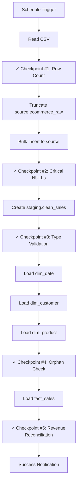

# ELT Pipeline Guide
**Extract, Load, Transform Pipeline** | January 22, 2026

**Orchestration:** n8n | **Database:** PostgreSQL 17.7 | **Refresh:** Daily 2 AM UTC | **Load Type:** Full refresh

---

## 1. Pipeline Flow



**Phase 1:** CSV → `source.ecommerce_raw` (all TEXT)  
**Phase 2:** Transform → `staging.clean_sales` (typed, cleaned)  
**Phase 3:** Load → `dwh` schema (star schema per [02_dwh_schema.md](./02_dwh_schema.md))  
**Phase 4:** Validate data quality (5 checkpoints)

**Prerequisites:** 
- Run [00_initial_setup.md](./00_initial_setup.md) once before first execution

---

## 2. Phase 1: Extract & Load

**Input:** `data.csv` (541,909 rows)  
**Output:** `source.ecommerce_raw` (all TEXT columns)  
**Tool:** n8n CSV Read → PostgreSQL Bulk Insert

### Checkpoint #1: Row Count Validation

```javascript
// n8n JavaScript node
const actualRows = items.length;
if (actualRows === 0) {
    throw new Error('CRITICAL: Source file is empty!');
}
return [{ json: { checkpoint: 'row_count', actual: actualRows, status: 'PASS' }}];
```

### Transaction-Safe Load

**n8n Node #1:** PostgreSQL Execute Query
```sql
BEGIN;
TRUNCATE TABLE source.ecommerce_raw;
```

**n8n Node #2:** PostgreSQL Insert Multiple  
**Table:** `source.ecommerce_raw`  
**Batch Size:** 1000 rows  
**Columns:** `[invoiceno, stockcode, description, quantity, invoicedate, unitprice, customerid, country]`

**n8n Node #3:** PostgreSQL Execute Query
```sql
COMMIT;
```

**Note:** If bulk insert fails, transaction rolls back automatically (table remains unchanged)

### Checkpoint #2: Critical NULLs & Data Length Check

```sql
SELECT 
    COUNT(*) FILTER (WHERE invoiceno IS NULL OR TRIM(invoiceno) = '') as null_invoice,
    COUNT(*) FILTER (WHERE stockcode IS NULL OR TRIM(stockcode) = '') as null_product,
    COUNT(*) FILTER (WHERE invoicedate IS NULL OR TRIM(invoicedate) = '') as null_date,
    COUNT(*) FILTER (WHERE LENGTH(TRIM(customerid)) > 20) as long_customerid
FROM source.ecommerce_raw;
```

```javascript
// n8n JavaScript validator
const r = items[0].json;
const errors = [];
if (r.null_invoice > 0) errors.push(`${r.null_invoice} NULL invoiceno`);
if (r.null_product > 0) errors.push(`${r.null_product} NULL stockcode`);
if (r.null_date > 0) errors.push(`${r.null_date} NULL invoicedate`);
if (r.long_customerid > 0) errors.push(`${r.long_customerid} customerid exceeds 20 chars (will be truncated)`);
if (errors.length > 0) throw new Error('Data Quality Issues:\n' + errors.join('\n'));
return [{ json: { checkpoint: 'critical_nulls', status: 'PASS' }}];
```

---

## 3. Phase 2: Transform

**Input:** `source.ecommerce_raw`  
**Output:** `staging.clean_sales`  
**Tool:** PostgreSQL CREATE TABLE AS

### Checkpoint #3: Pre-Validate Types

```sql
SELECT 
    invoiceno, 
    quantity, 
    unitprice, 
    invoicedate
FROM source.ecommerce_raw
WHERE 
   -- 1. Check for non-integer Quantity: 
   -- Allows an optional negative sign (for returns) followed only by digits.
   quantity !~ '^-?[0-9]+$'
   -- 2. Check for invalid UnitPrice: 
   -- Expects only digits and a single optional decimal point (no currency symbols).
   OR unitprice !~ '^[0-9]+\.?[0-9]*$'
   -- 3. Check for malformed InvoiceDate: 
   -- Matches specific format: MM/DD/YYYY HH:MI (e.g., 12/01/2010 08:26).
   OR invoicedate !~ '^\d{1,2}/\d{1,2}/\d{4} \d{1,2}:\d{2}$'
-- Limits output to the first 100 failures for logging and debugging purposes.
LIMIT 100;
```

```javascript
// n8n JavaScript - log errors to database
const badRows = items.length;
if (badRows > 0) {
    // Pass error rows to next node for INSERT into staging.etl_errors
    return items.map(row => ({
        json: {
            error_phase: 'TRANSFORM',
            error_message: 'Type validation failed',
            row_data: row.json
        }
    }));
}
return [{ json: { checkpoint: 'type_cast', status: 'PASS', invalid_rows: 0 }}];
```

**n8n Node (if errors found):** PostgreSQL Insert Multiple
```sql
-- Insert error rows into staging.etl_errors
INSERT INTO staging.etl_errors (error_phase, error_message, row_data)
VALUES ($1, $2, $3::jsonb);
```

### Create Staging Table

```sql
-- 1. Ensure a fresh start for the 'Full Refresh' load type by removing any existing staging table.
DROP TABLE IF EXISTS staging.clean_sales;

-- 2. Create the staging table with proper data types to enable mathematical analysis and date filtering.
CREATE TABLE staging.clean_sales AS
SELECT 
    invoiceno,
    stockcode,
    description,
    country,
    -- Convert quantity to integer for calculations (e.g., SUM).
    CAST(quantity AS INTEGER) as quantity,
    -- Convert unit price to a numeric decimal with 2-point precision.
    CAST(unitprice AS NUMERIC(10,2)) as unit_price,
    -- Parse the raw date string into a standard PostgreSQL timestamp.
    TO_TIMESTAMP(invoicedate, 'MM/DD/YYYY HH24:MI') as invoice_timestamp,
    -- Clean CustomerID: remove whitespace, treat empty strings as NULL, 
    -- and truncate to 20 characters to match the dim_customer schema.
    LEFT(NULLIF(TRIM(customerid), ''), 20) as customer_id,
    -- Apply Business Logic: Invoices starting with 'C' are returns; all others are sales.
    CASE WHEN LEFT(invoiceno, 1) = 'C' THEN 'RETURN' ELSE 'SALE' END as transaction_type,
    -- Extract only the date (YYYY-MM-DD) to simplify joins with the dim_date table.
    DATE(TO_TIMESTAMP(invoicedate, 'MM/DD/YYYY HH24:MI')) as invoice_date
FROM source.ecommerce_raw
-- 3. Data Quality Filter: Exclude records with zero quantity or non-positive prices
-- to ensure revenue calculations are not skewed by corrupted data.
WHERE CAST(quantity AS INTEGER) != 0
  AND CAST(unitprice AS NUMERIC(10,2)) > 0;
```

---

## 4. Phase 3: Load to DWH

**Input:** `staging.clean_sales`  
**Output:** `dwh.dim_date`, `dwh.dim_customer`, `dwh.dim_product`, `dwh.fact_sales`  
**Tool:** PostgreSQL INSERT statements

### 4.1 Load dim_date

```sql
INSERT INTO dwh.dim_date (
    date_key, 
    full_date, 
    day_of_week, 
    day_of_month, 
    month, 
    month_name, 
    quarter, 
    year, 
    is_weekend
)
SELECT 
    -- Create an integer surrogate key in YYYYMMDD format (e.g., 20101201).
    TO_CHAR(d, 'YYYYMMDD')::INTEGER as date_key,
    -- Store the actual DATE type for compatibility with BI tools like Superset.
    d::DATE as full_date,
    -- Extract the name of the day (e.g., 'Monday').
    TRIM(TO_CHAR(d, 'Day')) as day_of_week,
    -- Extract the numeric day of the month (1-31).
    EXTRACT(DAY FROM d)::INTEGER as day_of_month,
    -- Extract the numeric month (1-12).
    EXTRACT(MONTH FROM d)::INTEGER as month,
    -- Extract the full name of the month (e.g., 'January').
    TRIM(TO_CHAR(d, 'Month')) as month_name,
    -- Extract the calendar quarter (1-4).
    EXTRACT(QUARTER FROM d)::INTEGER as quarter,
    -- Extract the 4-digit year.
    EXTRACT(YEAR FROM d)::INTEGER as year,
    -- Determine if the date falls on a weekend (ISO Saturday=6, Sunday=7).
    EXTRACT(ISODOW FROM d) IN (6, 7) as is_weekend
-- Generate one row for every day between Jan 2010 and Dec 2012.
FROM generate_series('2010-01-01'::DATE, '2012-12-31'::DATE, '1 day') d
-- Prevent duplicate errors if the ELT script is re-run (Full Refresh logic).
ON CONFLICT (date_key) DO NOTHING;

/* Update table statistics for the PostgreSQL query planner.
   This ensures that JOINs between the fact table and dim_date stay fast.
*/
ANALYZE dwh.dim_date;
```

### 4.2 Load dim_customer

```sql
INSERT INTO dwh.dim_customer (customer_id, customer_type, first_purchase_date)
SELECT 
    DISTINCT 
    -- 1. Identity Logic:
    -- For registered users, use their existing ID.
    -- For guests (NULL ID), create a unique key by prefixing 'GST-' to the Invoice Number.
    CASE 
        WHEN customer_id IS NOT NULL THEN customer_id 
        ELSE 'GST-' || invoiceno  
    END as customer_id,

    -- 2. Classification Logic:
    -- Label the record so BI tools can easily filter out guests for retention metrics.
    CASE 
        WHEN customer_id IS NOT NULL THEN 'REGISTERED' 
        ELSE 'GUEST' 
    END as customer_type,

    -- 3. Behavioral Logic:
    -- Find the earliest invoice date associated with this ID to track customer vintage.
    MIN(invoice_date) as first_purchase_date
FROM staging.clean_sales
-- Grouping ensures we only create ONE record per customer/guest-invoice.
GROUP BY 1, 2

-- 4. Idempotency Check:
-- If the customer already exists in the dimension (from a previous load), 
-- skip them to preserve the original 'first_purchase_date'.
ON CONFLICT (customer_id) DO NOTHING;

ANALYZE dwh.dim_customer;
```

### 4.3 Load dim_product

```sql
INSERT INTO dwh.dim_product (stock_code, description, category)
SELECT DISTINCT
    stockcode,
    description,
    -- 1. Automated Categorization Engine:
    -- Searches the product description for keywords (e.g., 'MUG' or 'CANDLE').
    COALESCE(
        (SELECT category FROM staging.product_category_lookup 
         -- Perform a case-insensitive fuzzy match (ILIKE)
         WHERE description ILIKE '%' || keyword || '%'
         -- If multiple keywords match (e.g., 'CHRISTMAS MUG'), 
         -- use 'priority' to decide (1=Kitchenware, 3=Seasonal).
         ORDER BY priority ASC LIMIT 1),
        -- Default value if no keywords match.
        'Uncategorized'
    ) as category
FROM staging.clean_sales
-- 2. SCD Type 1 Logic (Overwrite):
-- If the stock_code already exists, update the description and category.
-- This ensures that if you update your 'keyword' lookup table, 
-- the categories refresh on the next ELT run.
ON CONFLICT (stock_code) DO UPDATE 
SET description = EXCLUDED.description, 
    category = EXCLUDED.category;

/* Update database statistics to optimize JOIN performance between 
   the 4,000 products and the 541,000 sales records. */
ANALYZE dwh.dim_product;
```

### Checkpoint #4: Orphan Facts Check

```sql
/* CHECKPOINT #4: ORPHAN CHECK (PRE-FACT LOAD)
   This query verifies that every 'Business Key' in your staging data 
   has a corresponding 'Surrogate Key' in the Dimension tables.
   If these counts are > 0, the Fact Table load will lose data.
*/

WITH unmapped_customers AS (
    -- Counts sales for registered customers that don't exist in dim_customer.
    -- (Guests are excluded here because they are handled by special logic).
    SELECT COUNT(*) as count FROM staging.clean_sales s
    WHERE s.customer_id IS NOT NULL
      AND NOT EXISTS (SELECT 1 FROM dwh.dim_customer c WHERE c.customer_id = s.customer_id)
),
unmapped_products AS (
    -- Counts sales for products that don't exist in dim_product.
    -- This often happens if new stock codes were added to the CSV.
    SELECT COUNT(*) as count FROM staging.clean_sales s
    WHERE NOT EXISTS (SELECT 1 FROM dwh.dim_product p WHERE p.stock_code = s.stockcode)
),
unmapped_dates AS (
    -- Counts sales with dates outside the range of dim_date.
    -- This happens if the CSV contains dates before 2010 or after 2012.
    SELECT COUNT(*) as count FROM staging.clean_sales s
    WHERE NOT EXISTS (SELECT 1 FROM dwh.dim_date d WHERE d.full_date = s.invoice_date)
)
SELECT 
    (SELECT count FROM unmapped_customers) as orphan_customers,
    (SELECT count FROM unmapped_products) as orphan_products,
    (SELECT count FROM unmapped_dates) as orphan_dates;
```

```javascript
// n8n JavaScript validator
const r = items[0].json;
const total = r.orphan_customers + r.orphan_products + r.orphan_dates;
if (total > 100) {
    throw new Error(`Too many orphans: ${total}\nCustomers: ${r.orphan_customers}, Products: ${r.orphan_products}, Dates: ${r.orphan_dates}`);
}
return [{ json: { checkpoint: 'orphan_facts', status: total === 0 ? 'PASS' : 'WARN', total_orphans: total }}];
```

### 4.4 Load fact_sales

```sql
INSERT INTO dwh.fact_sales (
    date_key, 
    customer_key, 
    product_key, 
    invoice_no, 
    transaction_type, 
    quantity, 
    unit_price, 
    line_total, 
    country
)
SELECT 
    d.date_key,
    c.customer_key,
    p.product_key,
    s.invoiceno,
    CASE WHEN s.quantity < 0 THEN 'RETURN' ELSE 'SALE' END,
    s.quantity,
    s.unitprice,
    (s.quantity * s.unitprice),
    s.country
FROM staging.clean_sales s
-- Join Date
JOIN dwh.dim_date d 
    ON d.full_date = s.invoice_date
-- Join Product
JOIN dwh.dim_product p 
    ON p.stock_code = s.stockcode
-- Join Customer (SIMPLIFIED: Matches the ID generated in Phase 4.2)
JOIN dwh.dim_customer c 
    ON c.customer_id = CASE 
        WHEN s.customer_id IS NOT NULL THEN s.customer_id 
        ELSE 'GST-' || s.invoiceno 
    END;

ANALYZE dwh.fact_sales;
```

---

## 5. Phase 4: Validation

### Checkpoint #5: Revenue Reconciliation

```sql
/* CHECKPOINT #5: REVENUE RECONCILIATION
   Final sanity check to ensure the Data Warehouse (DWH) accurately 
   reflects the financial totals from the Raw Source.
*/

WITH source_revenue AS (
    -- 1. Calculate "Expected" Revenue:
    -- Sums (Quantity * Price) directly from the raw text table.
    -- We apply the same filters used in Phase 2 (!= 0 and > 0) to get a fair comparison.
    SELECT SUM(CAST(quantity AS INTEGER) * CAST(unitprice AS NUMERIC(10,2))) as total
    FROM source.ecommerce_raw
    WHERE CAST(quantity AS INTEGER) != 0 AND CAST(unitprice AS NUMERIC(10,2)) > 0
),
dwh_revenue AS (
    -- 2. Calculate "Actual" Revenue:
    -- Sums the pre-calculated 'line_total' column from the final Star Schema.
    SELECT SUM(line_total) as total FROM dwh.fact_sales
)
SELECT 
    s.total as source_revenue,                 -- Total from the CSV load
    d.total as dwh_revenue,                    -- Total in the Star Schema
    ABS(s.total - d.total) as difference,      -- Absolute value of the gap
    -- 3. Calculate Variance Percentage:
    -- If this number is > 1.0%, the n8n pipeline is set to fail.
    ROUND(ABS((s.total - d.total) / s.total) * 100, 2) as variance_pct
FROM source_revenue s, dwh_revenue d;
```

```javascript
// n8n JavaScript validator
const r = items[0].json;
const variance = parseFloat(r.variance_pct);
if (variance > 1.0) {
    throw new Error(`Revenue variance: ${variance}%\nSource: $${r.source_revenue}\nDWH: $${r.dwh_revenue}`);
}
return [{ json: { checkpoint: 'revenue_reconciliation', status: 'PASS', variance: variance + '%' }}];
```

### Additional Checks (Non-Critical)

```sql
/* PRODUCT CATEGORIZATION COVERAGE 
   Target: < 10% Uncategorized
   Purpose: Identifies if the 'staging.product_category_lookup' table needs 
   new keywords to better classify the inventory.
*/

SELECT 
    -- Calculate the percentage of products that defaulted to 'Uncategorized'.
    -- The FILTER clause allows us to count specific rows within the total.
    ROUND(
        100.0 * COUNT(*) FILTER (WHERE category = 'Uncategorized') / COUNT(*), 
        2
    ) as uncategorized_pct
FROM dwh.dim_product;
```

---

## 6. n8n Workflow Configuration

**All PostgreSQL nodes:** `Continue on Fail = FALSE` (hard fail on errors)  
**Error notifications:** Slack webhook + Email  
**Timeout:** 30 minutes  
**Schedule:** Cron: `0 2 * * *` (daily at 2 AM UTC)

**Execution Order:**
```
Phase 1 → Checkpoint #1,#2 → Phase 2 → Checkpoint #3 → 
Phase 3 (dims) → Checkpoint #4 → Phase 3 (fact) → Checkpoint #5 → Success
```

---

## 7. Troubleshooting

| Error | Cause | Solution |
|-------|-------|----------|
| Checkpoint #1 failed | Empty CSV | Verify `data.csv` path in n8n |
| Checkpoint #2 failed | NULL/long fields | Check source data quality; customer_id >20 chars will be truncated |
| Checkpoint #3 warnings | Invalid dates/numbers | Review `staging.etl_errors` table for logged rows |
| Checkpoint #4 failed | Orphan facts >100 | Verify dimension loads completed, check temp_guest_mapping |
| Checkpoint #5 failed | Revenue variance >1% | Check `staging.clean_sales` filters |

**View error log:**
```sql
SELECT * FROM staging.etl_errors ORDER BY error_timestamp DESC LIMIT 100;
```

**Clear DWH for fresh reload:**
```sql
TRUNCATE TABLE dwh.fact_sales CASCADE;
TRUNCATE TABLE dwh.dim_customer RESTART IDENTITY CASCADE;
TRUNCATE TABLE dwh.dim_product RESTART IDENTITY CASCADE;
TRUNCATE TABLE dwh.dim_date CASCADE;
```

---

**DOCUMENT VERSION:** 3.0  
**LAST UPDATED:** January 22, 2026  
**RELATED:** [02_dwh_schema.md](./02_dwh_schema.md)
